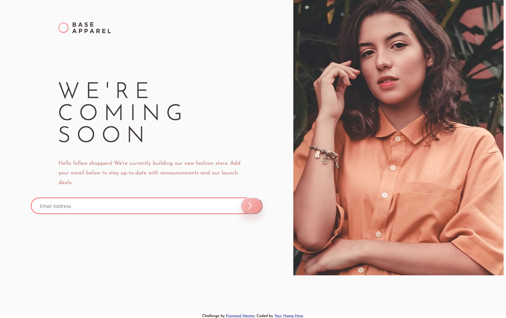

# Frontend Mentor - Base Apparel coming soon page solution

This is a solution to the [Base Apparel coming soon page challenge on Frontend Mentor](https://www.frontendmentor.io/challenges/base-apparel-coming-soon-page-5d46b47f8db8a7063f9331a0). Frontend Mentor challenges help you improve your coding skills by building realistic projects. 

## Table of contents


  - [The challenge](#the-challenge)
  - [Screenshot](#screenshot)
  - [Links](#links)
- [My process](#my-process)
  - [Built with](#built-with)
  - [What I learned](#what-i-learned)
  - [Continued development](#continued-development)
  - [Useful resources](#useful-resources)
- [Author](#author)
- [Acknowledgments](#acknowledgments)


### The challenge

Users should be able to:

- View the optimal layout for the site depending on their device's screen size
- See hover states for all interactive elements on the page
- Receive an error message when the `form` is submitted if:
  - The `input` field is empty
  - The email address is not formatted correctly

### Screenshot




### Links

- Solution URL: [https://github.com/Richard2957/base-apparel]
- Live Site URL: [https://richard2957.github.io/base-apparel]

## My process
Easiest to do it section by section, doing mobile and desktop at the same time.
### Built with

- Semantic HTML5 markup
- CSS custom properties
- Flexbox
-
### What I learned

Hardest thing was figuring out how to make the images move to the right place, I scratched my head very hard with flexbox. Eventually realised that using `display:none;` and overriding that in the media query was the answer.

Key bit of debugging code I used to compare my design with the given one:

```css
body>* {
    opacity: .8;
}

body::after {
    position: absolute;
    content: "";
    top: 0;
    width: 100%;
    height: 100%;
    bottom: 0;
    background: url("./design/desktop-design.jpg");
       background-repeat: no-repeat;
    animation: myflicker infinite alternate 2s;
}
@keyframes myflicker {
    from {
        opacity: .5;
    }
    to {
        opacity: .7;
    }
} 

```
Most of it is obvious - I added the animation to help work out which was mine and which was the design.


## Author


- Frontend Mentor - [https://www.frontendmentor.io/profile/Richard2957]
- Twitter - [https://www.twitter.com/Richard2957]
